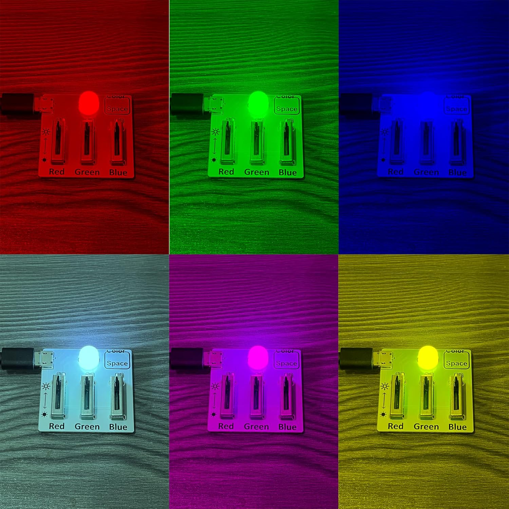
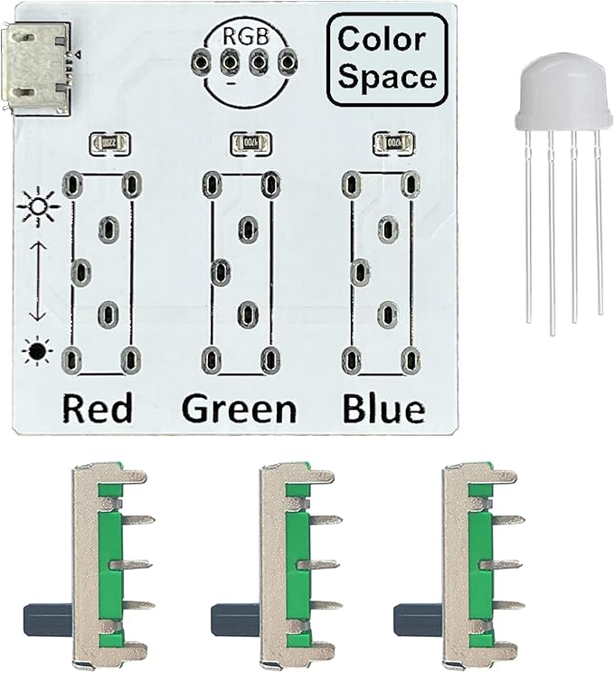

# Custom Object Detection System
This project is able to detect different custom objects (pc parts), identifying their presence and also classifying them into 10 different classes. The project is implemented on a Raspberry Pi, using the picamera as an input. 
full description coming soon (eta: September 2025)


| **Engineer** | **School** | **Area of Interest** | **Grade** |
|:--:|:--:|:--:|:--:|
| James Dai | Lynbrook High School | Computer Science | Incoming Senior


  
# Final Milestone

<iframe width="560" height="315" src="https://youtu.be/gTf-hnk4Yms" title="YouTube video player" frameborder="0" allow="accelerometer; autoplay; clipboard-write; encrypted-media; gyroscope; picture-in-picture; web-share" allowfullscreen></iframe>

For my final milestone, I was able to store images while using the model, to then later use to retrain the model for better results. After an object is detected, my script automatically saves the image after 3 seconds of detecting the same image. The model gives a prediction to what the image is classified as, and the user is able to manually adjust the classification when the model is incorrect. The image is then stored into a folder of the determined classification, and the script is then able to detect another object. After 100 objects are detected and classified, the script then sends the folders of images to a server hosted on my computer, which then can later be used to retrain the model. 

This project allowed me to learn more about node js, tensorflow, and python, allowing me to write files, run tensorflow models, and creating a server side that can then take post requests and parse the input. I hope to continue building onto this, eventually making the entire process fully automated, adding voice input to change classification, and also implementing this into an inventory management app.

Some challenges I faced when working on this milestone was with using python to save images, as well as using python to take input to manually adjust classification, as I was unfamiliar with python prior to this project. I had trouble using the correct libraries for these tasks, as I initially used some outdated libraries, or libraries that had other requirements (eg. keyboard, which required root user to use). Additionally, creating a GUI for the project failed because it was difficult efficiently implementing the picamera output to the GUI, since the way I did it was to take each frame, convert to the format that tkinter wanted, and then draw it on the GUI. Eventually, I just decided to use opencv to write text on the image, which was more effective, though more ugly. Another challenge I faced was with the Tensorflow .fit() function. Unfortunatly, this function was unable to be used on tensorflow lite, so this is why I sent the images to my server to then train my tensorflow model on the server, which I can then convert to a tflite model, and then send back to the Raspberry Pi. 


# Second Milestone

<iframe width="560" height="315" src="https://www.youtube.com/embed/AT3OThnL8Xg?si=XgJBNM3p1HWhB1Vl" title="YouTube video player" frameborder="0" allow="accelerometer; autoplay; clipboard-write; encrypted-media; gyroscope; picture-in-picture; web-share" referrerpolicy="strict-origin-when-cross-origin" allowfullscreen></iframe>

For my second milestone, I was able to build my own model from a dataset that I found online. I also wrote my own script to run the model on both my Piand my personal computer, taking input from either my webcam, my phone's camera, or my Raspberry Pi's camera. This is good because now i can work on testing and training models at home, using my phone as the camera. My next milestone will include me training my own model with my own dataset, which I will create using computer parts I have at home. The current model I have only has 80% test accuracy, so I'm hoping that my own dataset will be able to reach 90-95%. 

Some challenges that I've faced so far was setting up the environment for the Raspberry Pi, especially since I wanted to run everything on a virtual environment on the pi, so I needed to change a lot of settings that I've never touched before. It was also difficult installing required dependancies and libraries onto the venv, instead of the root user. Also, it was difficult to find a large enough dataset with the objects I was looking for, so this also is why I want to switch to using my own dataset. 


# Script for the Pi:
```python 

from picamera2 import picamera2
import cv2
import numpy as np
from tflite_runtime.interpreter import Interpreter
from piL import Image
import time

# --- Load labels from file ---
def load_labels(label_path):
    with open(label_path, 'r') as f:
        return [line.strip() for line in f.readlines()]

# --- Set the input tensor for the interpreter ---
def set_input_tensor(interpreter, image):
    input_details = interpreter.get_input_details()[0]
    interpreter.set_tensor(input_details['index'], image)

# --- Run inference and return top result ---
def classify_image(interpreter, image):
    set_input_tensor(interpreter, image)
    interpreter.invoke()

    output_details = interpreter.get_output_details()[0]
    output = interpreter.get_tensor(output_details['index'])[0]

    top_result = np.argmax(output)
    return top_result, output[top_result]

# --- Setup paths ---
MODEL_PATH = "pc1Stuff/skibPC.tflite"
LABEL_PATH = "pc1Stuff/labels.txt"

# --- Load model and allocate tensors ---
interpreter = Interpreter(MODEL_PATH)
interpreter.allocate_tensors()
input_details = interpreter.get_input_details()
_, height, width, _ = input_details[0]['shape']

# --- Load labels ---
labels = load_labels(LABEL_PATH)

# --- Initialize picamera2 ---
picam2 = picamera2()
picam2.preview_configuration.main.size = (800, 800)
picam2.preview_configuration.main.format = "RGB888"
picam2.configure("preview")
picam2.start()

# --- Main loop ---
print("Starting camera inference. Press 'q' to quit.")
while True:
    frame = picam2.capture_array()

    # Preprocess frame for model
    image = cv2.resize(frame, (width, height))
    # image = cv2.cvtColor(image, cv2.COLOR_RGB2GRAY)
    image = image.astype(np.float32) / 255.0
    image = np.expand_dims(image, axis=0)


    label_id, prob = classify_image(interpreter, image)
    label_text = f"{labels[label_id]} ({prob:.2f})"

    # Display result on image
    if prob > 0.7:

        cv2.putText(frame, f"{label_text}", (10, 30),
                    cv2.FONT_HERSHEY_SIMPLEX, 0.8, (0, 0, 255), 2)

    cv2.imshow("picamera2 - TFLite Classification", frame)
    
    if cv2.waitKey(25) & 0xFF == ord('q'):
        break
    
    

cv2.destroyAllWindows()
picam2.stop()
```


# First Milestone


<iframe width="560" height="315" src="https://www.youtube.com/embed/ByPvWhVvbA4?si=cmk9u-pumLP6hcHj" title="YouTube video player" frameborder="0" allow="accelerometer; autoplay; clipboard-write; encrypted-media; gyroscope; picture-in-picture; web-share" referrerpolicy="strict-origin-when-cross-origin" allowfullscreen></iframe>

My project consists of a Raspberry Pi with a camera and display, intending to detect custom object. The display will show what the camera is currently watching, and also show what the model identifies the object that is currently detected as. I have assembled the Raspberry Pi, display, and camera, and have confirmed that the default model (made for generic objects) works. 
I have implemented a generic tensorflow model, which is able to detect objects such as water bottles, notebooks, and plastic bags. I will later build my own model using my own data for objects such as screws and fans. So far, I had a few challenges regarding using SSH to connect to the Raspberry Pi, but figured out that it was because of the wifi I was connected to. 

<!---# Schematics 
Here's where you'll put images of your schematics. [Tinkercad](https://www.tinkercad.com/blog/official-guide-to-tinkercad-circuits) and [Fritzing](https://fritzing.org/learning/) are both great resoruces to create professional schematic diagrams, though BSE recommends Tinkercad becuase it can be done easily and for free in the browser. 

# Code
Here's where you'll put your code. The syntax below places it into a block of code. Follow the guide [here]([url](https://www.markdownguide.org/extended-syntax/)) to learn how to customize it to your project needs. 

```c++
void setup() {
  // put your setup code here, to run once:
  Serial.begin(9600);
  Serial.println("Hello World!");
}

void loop() {
  // put your main code here, to run repeatedly:

}
```-->

# Bill of Materials

| **Part** | **Note** | **Price** | **Link** |
|:--:|:--:|:--:|:--:|
| CanaKit Raspberry Pi4 4GB Starter PRO Kit - 4GB RAM | everything needed to use Raspberry pi, use Raspberry Pito run models | $119.99 | <a href="https://www.amazon.com/CanaKit-Raspberry-4GB-Starter-Kit/dp/B07V5JTMV9"> Link </a> |
| Adafruit BrainCraft HAT | display + i/o for Raspberry Pi| $44.99 | <a href="https://www.adafruit.com/product/4374"> Link </a> |
| Raspberry PiCamera Module 3 | camera for input, to detect objects | $29.99 | <a href="https://www.adafruit.com/product/5657?src=raspberrypi"> Link </a> |

<!---# Other Resources/Examples
One of the best parts about Github is that you can view how other people set up their own work. Here are some past BSE portfolios that are awesome examples. You can view how they set up their portfolio, and you can view their index.md files to understand how they implemented different portfolio components.
- [Example 1](https://trashytuber.github.io/YimingJiaBlueStamp/)
- [Example 2](https://sviatil0.github.io/Sviatoslav_BSE/)
- [Example 3](https://arneshkumar.github.io/arneshbluestamp/)-->

# Starter Project: RGB Light

<iframe width="560" height="315" src="https://www.youtube.com/embed/gTf-hnk4Yms?si=FRcMYHCrxDVDNE7l" title="YouTube video player" frameborder="0" allow="accelerometer; autoplay; clipboard-write; encrypted-media; gyroscope; picture-in-picture; web-share" referrerpolicy="strict-origin-when-cross-origin" allowfullscreen></iframe>

**About the Project**

For starter project, I started the project with a prebuilt board and identifiable parts. I then soldered on the correct parts to the correct location. As a final result, I was able to produce a board with a controllable rgb light, which was able to be controlled by three seperate sliders. I learned more about soldering, as well as more regarding power input in devices, as due to the low resistance, my board was unable to take power input from some variations of usbc cables. 



**Materials List**

PCB, LED
total cost: 7.99 (Linked <a href="https://www.adafruit.com/product/5657?src=raspberrypi">Here</a>)



